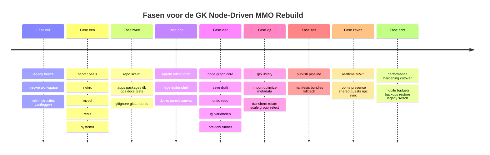

# Game data directory structuur future proof

## Executive summary

Voor GK hoort de toekomstvaste scheiding niet te liggen tussen “frontend” en “backend”, maar tussen vijf levenscycli: broncode, immutable releases, mutable projectdata, secrets en legacy. Daarom adviseer ik `/var/www/gk` op te delen in `repo/`, `releases/`, `current`, `data/`, `secrets/` en `legacy/`. Dat sluit aan op hoe systemd configuratie, state, cache en runtime-data scheidt, hoe Git gedeelde ignore-regels in `.gitignore` verwacht, en hoe `git worktree` meerdere werkbomen voor oud en nieuw naast elkaar kan beheren. Voor je 3D-library is `.glb` de juiste runtime-eenheid, omdat GLB JSON, buffers en afbeeldingen in één binaire container kan opslaan en zo extra requests of base64-overhead vermijdt. Voor persistente spel- en editordata past MySQL goed door JSON-velden met gegenereerde kolommen indexeerbaar te maken; Redis moet je beperken tot presence, room-fan-out en eventpijpen, omdat Pub/Sub at-most-once is en Streams juist bedoeld zijn voor persistente eventconsumptie. citeturn35view0turn13view0turn32view0turn17view3turn31view3turn27view0turn28view2turn14view1

De hoofdregel is: engine-primitieven mogen in code, spelinhoud nooit. Dus `spawn.glb`, `dialog`, `quest.share`, `hud.panel`, `group.transform` en `var.string` zijn generieke node-typen in code; alle concrete NPC’s, teksten, HUD’s, quests, namen, variabelen, posities en assetkoppelingen leven als data in de editor-database. “Save” schrijft alleen draft-revisies en editor-historie; “Publish” compileert een immutable release-manifest en runtime-bundle; het live spel leest uitsluitend gepubliceerde releases. Voor een browser-MMO is `wss` de veilige standaard en moeten realtime berichten klein en begrensd blijven, omdat de breed ondersteunde WebSocket-API geen backpressure heeft. citeturn33view3turn25view3turn25view4

De exacte tekst van de legacy `## Role`-instructie uit de bijlage is hier inhoudelijk ongespecificeerd. Behandel die daarom in fase nul als te bevriezen legacy-input: kopiëren naar een versiebeheerd projectdocument, daarna niet meer vertrouwen op “agent-geheugen” buiten de repo.

## Ontwerpprincipes

De eerste harde grens is tussen **definitie** en **toestand**. Quests, dialogen, NPC-archetypes, HUD-layouts, spawnregels en editor-canvasinformatie zijn definities en horen in node-graphs thuis. Party-questprogressie, itemtoekenning, room-presence, NPC-runtime-state en matchmaking zijn toestand en horen in runtime-tabellen en/of hot caches thuis. Gebruik Redis Pub/Sub alleen voor verlies-tolerante fan-out zoals “speler beweegt hier nu”; gebruik Redis Streams of een MySQL-outbox voor gebeurtenissen die niet kwijt mogen raken, zoals quest-acceptatie, beloningen, moderation-acties en publish-jobs. citeturn27view0turn28view1turn28view2turn31view3

De tweede harde grens is tussen **node-type** en **node-instantie**. Je maakt dus niet één node-type per quest, NPC of HUD-paneel. Je maakt generieke families, bijvoorbeeld `var.*`, `dialog.*`, `quest.*`, `spawn.*`, `hud.*`, `party.*`, `inventory.*`, `condition.*` en `transform.*`. De inhoud van de game zit vervolgens in de instanties van die families. Zo voorkom je dat de codebase over tien jaar ontploft door inhoudelijke uitzonderingen.

De derde grens is tussen **runtime-library** en **editor-afgeleiden**. Houd de runtime-library strikt `.glb`-only. Editor-thumbnails, previews of analysecaches mogen bestaan, maar uitsluitend als afgeleide editor-assets buiten de game-runtime. De glTF-specificatie beschrijft expliciet dat Binary glTF met `.glb` JSON en binaire inhoud in één blob levert, en dat alternatieven met base64 extra bestandsgrootte en decodeerwerk toevoegen. citeturn17view3turn17view4

De vierde grens is tussen **draft** en **published**. Drafts zijn bewerkbaar, kunnen onvolledig zijn, mogen editor-specifieke metadata bevatten en kunnen een eigen undo/redo-verleden hebben. Published data is immutable en minimalistisch: alleen wat de game nodig heeft om te draaien. Die scheiding is nodig om “opslaan” en “publiceren” echt van elkaar te scheiden, en om rollback later triviaal te maken.

De vijfde grens is tussen **hot path** en **koud archief**. Een single-server MMO met een groeipad naar ongeveer 4000 gelijktijdige spelers vraagt niet meteen om distributed systems, maar wel om discipline: zone- of room-scoping in realtime, immutable releases, querybare maar smalle runtime-tabellen, en pas partitie/splitsing op append-heavy event- of history-tabellen wanneer die groot worden. MySQL-partitionering verdeelt rijen fysiek over partities en kan partition pruning toepassen; MySQL-replicatie is een later groeipad voor back-ups en read-scale. In de browser hoort de client op gepubliceerde, compacte manifesten te draaien en te renderen met `requestAnimationFrame`, waarvan de callbackfrequentie normaal het scherm volgt en in verborgen tabs meestal wordt gepauzeerd. citeturn8view0turn14view3turn29view4turn25view2

Een compacte regelset die je aan GK Code Copiloot kunt geven is deze:

| Laag | Mag hard-coded zijn | Mag niet hard-coded zijn |
|---|---|---|
| Engine | node-executor, authenticatie, validatie, protocol, publish-compiler, asset-pipeline | quests, dialogen, NPC-namen, HUD-inhoud, world-layout |
| Editor | canvas, docking, inspector, selectie/gizmo, history-engine | concrete game-objecten in de startscene |
| Runtime | room-loop, delta-serializer, interest-management, state-reconciler | concrete content van quests/NPC’s/HUD |
| Data | niets “hard-coded”; alleen opgeslagen/gegenereerde data | handmatige runtime-hacks buiten publish-flow |

## Aanbevolen serverhiërarchie

De live datadirs van MySQL en Redis mogen op hun standaard servicepaden blijven; deze structuur beschrijft wat jij projectmatig beheert onder `/var/www/gk`: broncode, assets, manifests, imports, exports, back-ups en deploys.

```text
/var/www/gk
├─ legacy/
│  └─ game-gk-legacy/
├─ repo/
│  ├─ apps/
│  │  ├─ editor-web/
│  │  ├─ game-web/
│  │  ├─ realtime-gateway/
│  │  ├─ world-service/
│  │  ├─ publish-service/
│  │  └─ asset-worker/
│  ├─ packages/
│  │  ├─ node-engine/
│  │  ├─ node-types/
│  │  ├─ net-protocol/
│  │  ├─ schemas/
│  │  └─ shared-ui/
│  ├─ db/
│  │  ├─ migrations/
│  │  └─ seeds/
│  ├─ ops/
│  │  ├─ nginx/
│  │  ├─ systemd/
│  │  └─ scripts/
│  ├─ docs/
│  │  └─ architecture/
│  ├─ tests/
│  ├─ .gitignore
│  ├─ .gitattributes
│  ├─ package.json
│  ├─ pnpm-workspace.yaml
│  └─ tsconfig.base.json
├─ releases/
│  └─ <release-id>/
│     ├─ public/
│     │  ├─ editor/
│     │  └─ game/
│     └─ server/
├─ current -> /var/www/gk/releases/<release-id>
├─ data/
│  ├─ assets/
│  │  ├─ source-glb/
│  │  ├─ optimized-glb/
│  │  ├─ thumbnails/
│  │  └─ metadata/
│  ├─ drafts/
│  │  ├─ graph-exports/
│  │  └─ publish-staging/
│  ├─ published/
│  │  ├─ manifests/
│  │  ├─ bundles/
│  │  └─ rollback/
│  ├─ imports/
│  ├─ tmp/
│  └─ backups/
│     ├─ mysql/
│     ├─ redis/
│     ├─ assets/
│     └─ releases/
└─ secrets/
   ├─ editor.env
   ├─ runtime.env
   ├─ publish.env
   └─ mysql/
```

Nginx mag alleen naar de gebouwde publieke mappen onder `current/public/` wijzen. De `root`-directive bouwt het bestandspad door de URI aan `root` toe te voegen; zet je die op `repo/`, `data/` of `secrets/`, dan maak je het veel makkelijker om interne bestanden te lekken. Gebruik `try_files` voor statische assets en een expliciete fallback naar de SPA of gateway. Systemd-services horen met een read-only basis te draaien en alleen de strikt noodzakelijke schrijfbare paden te krijgen. systemd ondersteunt daar expliciet `StateDirectory=`, `RuntimeDirectory=`, `ReadWritePaths=` en `ProtectSystem=` voor. citeturn30view0turn30view2turn35view0

## Beheercontract per map en bestand

Onderstaande tabellen beschrijven niet elke toekomstige individuele file, maar het **contract per map- en bestandstype**. Nieuwe onderdelen moeten dit patroon volgen, zodat nieuwe functionaliteit niet in één bestand belandt.

### Serverniveau onder `/var/www/gk`

| Pad of patroon | Doel en waarom nodig | Groei en splitsing | Onderhoud | Versiebeheer en backup | Beveiliging en permissies | Schaling en 10 jaar evolutie |
|---|---|---|---|---|---|---|
| `/var/www/gk/legacy/` | Bevroren oude game, puur voor referentie, rollback en extractie van assets/data | Groei stopt na fase nul; nooit actief doorontwikkelen | Alleen beheerder | Geen actieve commits; wel éénmalige tar/db-snapshot | Read-only voor normale services | Houdt oude en nieuwe wereld schoon gescheiden |
| `/var/www/gk/repo/` | Enige actieve broncodeboom | Groei blijft beheersbaar door `apps/` + `packages/`; nooit runtime-data hierin opslaan | GK Code Copiloot en Codex via vaste fasebestanden | Git is bron van waarheid; geen back-ups/logs hier | `2750`, eigenaar deploy-user, group service-devs | Houdt refactors lokaal per bounded context |
| `/var/www/gk/releases/` | Immutable build-output per release | Groeit lineair; prune op retentie, bv. laatste 10–20 releases | Alleen deploy/publish-service schrijft | Niet in Git; wel retentie-backup voor rollback | Runtime read-only | Snel terugzetten door symlink-switch |
| `/var/www/gk/current` | Actieve release-pointer | Wordt nooit groot | Alleen deploy/publish-service wijzigt | Niet apart back-uppen | Alleen deploy-user mag wijzigen | Zero-downtime rollback-pad |
| `/var/www/gk/data/assets/source-glb/` | Handgemaakte bron-GLB’s; enige “artist/source of truth” voor 3D-library | Kan groot worden; split per domein `characters/`, `props/`, `world/`, `fx/` | Asset-owner + import-worker | Dagelijkse file-backup; Git LFS alleen als jouw remote dit ondersteunt | Schrijfbaar voor asset-beheerders, read voor import-worker | Hashing en domeinmappen maken latere CDN/object-store migratie eenvoudig |
| `/var/www/gk/data/assets/optimized-glb/` | Gegenereerde runtime-GLB’s voor game/editor-preview | Wordt groot; split op hash-prefix of per release als nodig | Alleen asset-worker | Niet in Git; regenerabel uit source + pipeline | Runtime read-only | Maakt mobiele/web-prestatie voorspelbaar |
| `/var/www/gk/data/assets/thumbnails/` | Editor-only previews; geen gameplay-asset | Kan groot worden; per 2 eerste tekens van hash opsplitsen | Alleen asset-worker | Niet in Git; regenerabel | Alleen editor en asset-worker lezen | Geen impact op game-runtime zolang strikt gescheiden |
| `/var/www/gk/data/assets/metadata/` | Afgeleide metadata en export-caches over assets, usage counts, NPC usage, budgets | Klein tot middelgroot; splitsen per assettype of jaar als miljoenen records/-exports ontstaan | Asset-worker + admin-tools | Autoritatieve versie in DB; file-extracts zijn cache/export | Alleen services, niet publiek | Ondersteunt analyses zonder de library te scannen |
| `/var/www/gk/data/drafts/graph-exports/` | Gecontroleerde draft-exports voor support, diffing, migratie | Mag groeien; split per project en maand | Publish/editor services | Niet in Git; backup mee als werkdata | Alleen editor- en publish-service | Maakt support en herstel van editorblokken eenvoudiger |
| `/var/www/gk/data/drafts/publish-staging/` | Tijdelijke compile-output vóór publish-commit | Kortlevend; automatisch legen | Alleen publish-service | Niet back-uppen behalve bij incidentanalyse | Temp dir, strakke rechten | Houdt publish netjes geïsoleerd |
| `/var/www/gk/data/published/manifests/` | Immutable manifest per release, bron voor runtime | Groeit lineair; per jaar of hash-prefix opsplitsen | Alleen publish-service schrijft | Altijd back-uppen; nooit handmatig editen | Runtime read-only | Sleutel voor rollback, audits en multi-release |
| `/var/www/gk/data/published/bundles/` | Gecompileerde publicatiebundels, los van draftdata | Groeit lineair; retentie per release | Alleen publish-service | Backup volgens release-retentie | Runtime read-only | Laat meerdere serverprocessen dezelfde release lezen |
| `/var/www/gk/data/published/rollback/` | Kleine pointers of export-stukken voor snelle rollback | Blijft klein | Alleen publish/deploy | Niet in Git, wel backup | Alleen deploy/publish | Rollback blijft operationeel eenvoudig |
| `/var/www/gk/data/imports/` | Importpakketjes uit legacy of externe tools | Mag groeien; per importbatch bewaren, daarna archiveren of verwijderen | Alleen import-tools | Niet in Git; tijdgebonden backup | Niet publiek, write beperkt | Houdt migraties reproduceerbaar |
| `/var/www/gk/data/tmp/` | Tijdelijke bestanden; nooit business-critical | Mag niet structureel groeien; automatische cleanup | Services zelf | Niet back-uppen | `1770` of service-specifiek; auto-clean | Voorkomt vervuiling van repo en releases |
| `/var/www/gk/data/backups/` | Projectniveau back-ups en exports | Wordt groot; split op type en datum, plus retentie | Alleen backup/restore tooling | Nooit in Git; checksum + restore-test verplicht | Zeer strakke rechten; liefst root + backup-group | Draagt disaster recovery en migraties |
| `/var/www/gk/secrets/` | Werkelijke secrets, certificaten, DB-credentials | Blijft klein | Alleen beheerder/Codex voor hostsetup | Niet in Git; apart back-uppen en versleutelen | `0750` dirs, `0640` files; nooit via Nginx | Houdt rotatie en service-isolatie schoon |

### Repo-interne structuur onder `/var/www/gk/repo`

| Pad of patroon | Doel en waarom nodig | Groei en splitsing | Onderhoud | Versiebeheer en backup | Beveiliging en permissies | Schaling en 10 jaar evolutie |
|---|---|---|---|---|---|---|
| `apps/editor-web/` | Editor-app met aparte login, node-canvas, linker raster, rechter add/inspect-menu, HUD-builder, userbeheer | Split intern in `auth/`, `canvas/`, `library/`, `hud/`, `admin/` als >20k–30k LOC | GK Code Copiloot | Git | Alleen build/read voor runtime; geen secrets | Nieuwe editorfuncties blijven uit gameclient |
| `apps/game-web/` | Browser/mobile runtime, leest alleen published data | Split intern in `scene/`, `ui/`, `net/`, `entities/` als nodig | GK Code Copiloot | Git | Publieke build; geen admincode | Houdt client licht en publish-gebonden |
| `apps/realtime-gateway/` | WebSocket ingress, sessievalidatie, room-routing, rate-limits | Split pas als gateway en matchmaking uiteenlopen | Codex/GK | Git | Alleen service-user; altijd via `wss` | Eerste stap naar multi-process of multi-host |
| `apps/world-service/` | Autoritatieve room/zone-logica, party-sync, quest-sharing, NPC-runtime-state | Splitsen per bounded context of per zone-worker zodra druk toeneemt | GK Code Copiloot | Git | Alleen service-user | Natuurlijk groeipad naar meerdere wereldprocessen |
| `apps/publish-service/` | Valideert drafts, compileert manifests, schrijft releases en rollback-metadata | Blijft middelgroot; split pas bij complexe CI/CD | GK Code Copiloot | Git | Alleen publish-user mag schrijven naar `releases/` en `data/published/` | Bewaart save/publish-scheiding |
| `apps/asset-worker/` | Import, validatie, optimalisatie, thumbnails, usage-rebuilds, metadata | Split intern in `import/`, `optimize/`, `stats/` als nodig | GK Code Copiloot | Git | Alleen asset/data write-rechten | Ontkoppelt zware assettaken van editor en game |
| `packages/node-engine/` | Uitvoering, evaluatie, preview, geschiedenis en compileerlogica voor nodes | Split in `executor/`, `compiler/`, `history/`, `variables/` zodra het te groot wordt | GK Code Copiloot | Git | Geen directe publieke toegang | Houdt nodegedrag centraal en herbruikbaar |
| `packages/node-types/<domain>/<node>.node.ts` | Één file per generiek node-type; geen monolithisch registerbestand | Domainmap split pas als een domein >20–30 nodes heeft | GK Code Copiloot | Git | Normale codeperms | Voorkomt “alles in één bestand” voor komende jaren |
| `packages/net-protocol/` | Schema’s voor realtime packets, delta’s, snapshots, rate limits | Blijft klein als je per berichttype één file houdt | GK Code Copiloot | Git | Geen secrets | Belangrijk omdat browser-WebSocket geen backpressure heeft |
| `packages/schemas/` | JSON/Zod/TS-schema’s voor node-instanties, assets, users, releases | Split per domein; geen gigantisch schema-bestand | GK Code Copiloot | Git | Geen secrets | Houdt data- en publish-contracten stabiel |
| `packages/shared-ui/` | Docking, panel-host, property-editors, gizmos, inspectiewidgets | Split in `dock/`, `widgets/`, `inspectors/` als nodig | GK Code Copiloot | Git | Geen adminsecrets | Editor blijft modulair wanneer HUD en admin groeien |
| `db/migrations/<schema>/` | Geordende migraties per schema, bv. `auth/`, `editor/`, `runtime/` | Jaarmappen toevoegen als bestandenaantal groot wordt | Codex voor DB-setup, GK voor app-migraties | Git; DB-backups elders | Alleen CI/deploy voert uit | Onmisbaar voor 10 jaar evolutie |
| `db/seeds/` | Minimale seeddata: admin-rollen, basis node-families, lege templates | Klein houden; geen gamecontent dumpen | GK Code Copiloot | Git | Geen echte secrets | Nieuwe servers snel reproduceerbaar |
| `ops/systemd/` | Unitfiles en drop-ins voor alle services | Blijft klein; één file per service | Codex schrijft/installeert, repo bewaart waarheid | Git | Root/deploy alleen | Legt servicegrenzen duurzaam vast |
| `ops/nginx/` | Vhost- en location-config die alleen `current/public` serveert | Blijft klein | Codex | Git | Root/deploy alleen | Maakt cutover veilig en reproduceerbaar |
| `ops/scripts/` | Idempotente host-, deploy-, restore- en maintenance-scripts | Split per nummer/fase, bv. `010-init-dirs.sh` | Vooral Codex voor hostzaken | Git | Uitvoerbaar alleen voor beheerder/deploy | Geen handmatig knip-en-plak beheer na vijf jaar |
| `docs/architecture/` | Enige levende architectuurdocs; geen README-sprawl | Maximaal een klein setje kernbestanden | Jij + GK Code Copiloot | Git | Geen secrets | Houdt kennis in repo en niet in agentgeheugen |
| `tests/` | Contract-, e2e- en loadtest-scripts | Split per app/domein als nodig | GK Code Copiloot | Git | Geen secrets | Nodig om 60fps- en multiplayer-regressies vroeg te vinden |
| `.gitignore` | Alleen gedeelde build/byproduct-ignore-regels | Hoort klein te blijven; per-dir `.gitignore` alleen bij uitzondering | Jij/GK | Git | n.v.t. | Houdt repo schoon; user-specifieke rommel hoort elders |
| `.gitattributes` | Bepaalt LFS/diff gedrag voor binaire assets indien gebruikt | Blijft klein | Jij/GK | Git | n.v.t. | Houdt binaire regels expliciet en herhaalbaar |
| `package.json` | Workspace scripts en laagste package-metadata | Grootte beperken door scripts naar `ops/scripts/` te verplaatsen | GK Code Copiloot | Git | Geen secrets | Startpunt voor repeatable builds |
| `pnpm-workspace.yaml` | Workspace-definitie voor monorepo | Blijft klein | GK Code Copiloot | Git | n.v.t. | Nieuwe apps/packages toevoegen zonder structuurbreuk |
| `tsconfig.base.json` | Basale TS-compileerregels voor alle apps/packages | Blijft klein; per app overrides lokaal | GK Code Copiloot | Git | n.v.t. | Houdt typegrenzen consistent |

Gebruik in de repo geen losse, verwaarloosde README’s. Beperk markdown-documentatie tot een klein, levend pakket, bijvoorbeeld:

- `docs/architecture/game-data-directory-structuur-future-proof.md`
- `docs/architecture/copilot-operating-rules.md`
- `docs/architecture/current-phase.md`
- `docs/architecture/release-policy.md`

Alles wat niet blijvend onderhouden wordt, hoort niet als `.md` in de repo.

## Datamodellen en publicatiepad

De meest stabiele opslagindeling voor jouw MMO is een hybride model: **MySQL als autoritatieve store voor definities en duurzame toestand**, **Redis voor hete realtime toestand en eventpijpen**, en **filesystem voor immutable binaries en releasebundels**. MySQL JSON kun je prima gebruiken voor node-parameterblokken, maar zwaar bevraagde velden zoals `node_type`, `asset_id`, `quest_key`, `publish_status` en `room_scope` horen via gegenereerde kolommen of `JSON_VALUE()` indirect indexeerbaar gemaakt te worden, omdat JSON-kolommen niet direct indexeerbaar zijn. Redis Pub/Sub is geschikt voor snelle fan-out maar heeft at-most-once semantics; zodra verlies niet acceptabel is, hoort de gebeurtenis naar Streams of naar MySQL-outbox/transactions. Voor back-ups is een combinatie van volledige back-ups plus point-in-time herstel via binary logs logisch; Redis raadt zelf AOF in combinatie met periodieke RDB-snapshots aan voor herstel en snellere restarts. citeturn31view3turn31view1turn27view0turn28view2turn29view4turn34view0turn14view1

### Autoritatieve plaats per datasoort

| Concern | Autoritatieve opslag | Afgeleide opslag | Opmerking |
|---|---|---|---|
| Editor-drafts | MySQL `gk_editor` | `data/drafts/graph-exports/` | Save schrijft alleen hier |
| Published node-graphs | MySQL `gk_runtime.release_*` | `data/published/manifests/` en `bundles/` | Publish maakt immutable release |
| Game users | MySQL `gk_auth` / `gk_runtime` | Admin-export indien nodig | Editor-users apart van spelers |
| Undo/redo | MySQL `editor_operation_log` + checkpoint-tabel | optionele draft-export | Configurabele historie per graph/project |
| Presence en room snapshots | Redis | geen, of korte temp dumps | Verlies-tolerant |
| Duurzame events | Redis Streams of MySQL outbox | geen | Voor rewards, publish, moderation |
| Bron-GLB’s | `data/assets/source-glb/` | metadata in DB | Nooit direct live serveren |
| Geoptimaliseerde runtime-GLB’s | `data/assets/optimized-glb/` | usage-metagegevens | Regenerabel |
| HUD-definities | Published node-graphs | release-manifest | Geen los hard-coded HUD-script |
| Shared quests | Quest-definitie in nodes; runtime state in MySQL/Redis | manifest + hot cache | Definities en progressie bewust gescheiden |

### Voorbeeldbestandsnamen

Gebruik stabiele, semantische namen. Bijvoorbeeld:

- `asset.character.blacksmith.v003.glb`
- `asset.world.main_town.signpost.v001.glb`
- `release.2026-06-08T120000Z.manifest.json`
- `m20260608_001_create_graph_nodes.sql`
- `gk-world.service`

### Voorbeeld van een node-object

```json
{
  "id": "node.quest.share.blacksmith_intro",
  "graphId": "graph.world.main_town",
  "revisionId": "rev000142",
  "type": "quest.share",
  "mode": "draft",
  "canvas": { "x": 1280, "y": 420, "w": 360, "h": 220 },
  "params": {
    "questKey": "quest.blacksmith_intro",
    "title": "@game.name :: De smid zoekt hulp",
    "shareMode": "party",
    "speakerName": "@npc.blacksmith.name"
  },
  "bindings": {
    "onAccepted": "node.party.sync_01.out.accepted",
    "onCompleted": "node.reward_02.in.start"
  },
  "compileHints": {
    "roomScope": "zone.main_town",
    "latencyClass": "realtime"
  }
}
```

Dit object hoort niet als losse contentfile in Git te leven, maar als rij in de editor-database, met een compacte export alleen voor support of herstel. Het belangrijke ontwerpdetail is dat concrete waarden via variabelen zoals `@game.name` en `@npc.blacksmith.name` worden gebonden, zodat contenthergebruik groeit zonder nieuwe code-klassen.

### Voorbeeld van library-metadata

```json
{
  "assetId": "asset.character.blacksmith.v003",
  "category": "npc-model",
  "sourcePath": "data/assets/source-glb/characters/blacksmith/asset.character.blacksmith.v003.glb",
  "runtimePath": "data/assets/optimized-glb/7f/4c/asset.character.blacksmith.v003.7f4c.glb",
  "sha256": "7f4c...ab91",
  "budgets": {
    "triangles": 18420,
    "materials": 2,
    "animations": 4
  },
  "usage": {
    "graphs": 14,
    "placedInstances": 93,
    "npcInstances": 12
  },
  "publish": {
    "status": "published",
    "releaseId": "rel_2026_06_08_120000"
  }
}
```

Deze metadata maakt de library bestuurbaar zonder directory-scans bij elk schermbezoek. De usage-tellers zijn afgeleid, dus ze mogen rebuildbaar zijn.

### Voorbeeld van een player-record

```json
{
  "playerId": "player_004281",
  "accountStatus": "active",
  "roles": ["player"],
  "profile": {
    "displayName": "GKSpeler"
  },
  "partyId": "party_702",
  "sharedQuestStateVersion": 42,
  "lastShard": "zone.main_town",
  "moderation": {
    "bannedUntil": null,
    "deletedAt": null
  }
}
```

Editor-accounts horen in een aparte auth/editor-scope thuis, zodat “aparte editor-login” ook technisch echt gescheiden blijft van spelersauthenticatie.

### Publicatiepad

Het publicatiepad hoort zo te lopen:

`Editor save -> draft-revisies in MySQL -> preview-runner -> publish-validatie -> immutable release-manifest -> release-bundle -> current release switch -> game runtime`

Dat levert drie praktische voordelen op. Ten eerste kan de editor realtime werken zonder het live spel te vervuilen. Ten tweede kun je rollback simpel doen door `current` en `current_release_id` terug te zetten. Ten derde kun je mobiele prestaties begrenzen door de gameclient alleen gepubliceerde, gecompileerde data te laten lezen in plaats van ruwe editor-structuren. Voor browser-realtime blijft WebSocket de nuchtere keuze omdat die breed ondersteund is; beperk daarom berichtgroottes, stuur interest-scoped delta’s en behandel de gateway als streng bounded protocol-laag. citeturn25view3turn25view4turn24view0

## Fase-roadmap voor GK Code Copiloot

De slimste aanpak is niet “alles tegelijk laten bouwen”, maar **één fase tegelijk, met een expliciet acceptatiecontract per fase**. Gebruik GK Code Copiloot voor repo-inhoud en applicatiecode. Gebruik Codex op je code-server alleen voor hosttaken die buiten de appcode vallen, zoals OS-packages, MySQL/Redis/Nginx/systemd, permissies, directorycreatie, certs en `.gitignore`/workspace-rommel die niet in de productcode thuishoort. Voor oude en nieuwe code op dezelfde server is een schone tweede werkboom of compleet nieuwe workspace de juiste start; `git worktree` bestaat precies om meerdere werkbomen naast dezelfde repository beheerd naast elkaar te laten leven. citeturn32view0turn13view0



### Fase-overzicht met taken, afhankelijkheden en checklists

| Fase | Doel | Afhankelijkheden | Taken voor GK Code Copiloot en Codex | Acceptatiechecklist |
|---|---|---|---|---|
| **Fase nul** | Oude game bevriezen en werkruimte opschonen | Geen | **Codex:** snapshot oude DB, assets en webroot; verplaats oude game naar `legacy/`; maak nieuwe workspace of `git worktree`; zorg dat code-server alleen `repo/` indexeert. **Jij:** kopieer de huidige custom `## Role`-tekst één-op-één naar `docs/architecture/copilot-operating-rules.md`; markeer ongespecificeerde regels expliciet. | Oude game draait nog read-only of is veilig te herstellen; nieuwe workspace bevat geen actieve oude bronbestanden; Copilot werkt alleen op nieuwe repo |
| **Fase een** | Serverfundering opzetten | Fase nul | **Codex:** maak directoryboom, unix-users/groups, Nginx, MySQL, Redis, Node LTS, pnpm, TLS, `wss`, systemd-units, backup- en restore-scripts. Gebruik systemd met `ProtectSystem`, `ReadWritePaths`, `StateDirectory` waar passend. | `https://editor...` en `https://game...` geven een lege shell; `wss` werkt; MySQL en Redis health checks groen; backups kunnen gestart worden |
| **Fase twee** | Repo-skelet en werkafspraken vastleggen | Fase een | **GK:** maak `apps/`, `packages/`, `db/`, `ops/`, `docs/`, `tests/`. Voeg `.gitignore`, `.gitattributes`, workspace-manifest, basis build scripts toe. Geen runtime-data in repo. | Schone clone/build werkt; repo bevat geen gegenereerde binaries, logs of secrets; docs-map bevat alleen levende kernbestanden |
| **Fase drie** | Editor-shell met aparte login en leeg canvas | Fase twee | **GK:** editor-auth, rollen, docking-host, linker node-raster, rechter node-menu/inspector, lege world/view, userbeheer voor game users. | Inloggen op editor staat los van game-login; wereld is leeg bij start; geen hard-coded scene-content zichtbaar |
| **Fase vier** | Node-graph kern bouwen | Fase drie | **GK:** graph-model, nodes/edges, variable resolution met `@`, history-engine voor undo/redo, instelbare historiediepte, node-preview in draft-namespace, selectie/groepering, translate/rotate/scale. | `Ctrl+Z` en `Ctrl+Shift+Z` werken; save raakt live game niet; basis nodes kunnen wereldobjecten en teksten parametrisch aanmaken |
| **Fase vijf** | GLB-library en placement flow bouwen | Fase vier | **GK:** `.glb` import, validatie, metadata, optimized runtime build, thumbnails, usage counts, NPC counts, placement en transform-nodes. | Alleen `.glb`-assets komen in runtime-library; alles kan geplaatst, geroteerd, geschaald en gegroepeerd worden via nodes |
| **Fase zes** | Publish-pipeline bouwen | Fase vier en vijf | **GK:** validatie, compile naar immutable manifest, bundle-output, release-id, rollback pointers, publish audit trail. | Save update alleen editor-draft; publish zet pas live game om; rollback naar vorige release werkt |
| **Fase zeven** | Realtime MMO-fundament bouwen | Fase zes | **GK:** realtime-gateway, room/zone state, presence, authoritative sync, shared quests, party state, NPC sync, delta-protocol, reconnect-flow. **Codex:** tune Redis/MySQL/Nginx/systemd waar nodig. | Twee clients zien elkaar realtime; party/shared quest werkt; NPC-state is consistent voor meerdere spelers |
| **Fase acht** | Performance, hardening en cutover | Alle vorige | **GK:** mobiele budgetchecks, asset budgets, payload budgets, lazy loading, metrics, profiler hooks, e2e/loadtests. **Codex:** restore-drill, backup-verificatie, legacy switch-plan, permission-review. | Mobiele browser haalt afgesproken performancebudgetten; restore is getest; old/new cutover-plan ligt vast; geen secrets of back-ups in repo |

### Werkregels voor GK Code Copiloot

Laat GK Code Copiloot steeds met drie vaste invoerbestanden werken:

1. `docs/architecture/current-phase.md`  
2. `docs/architecture/copilot-operating-rules.md`  
3. `docs/architecture/game-data-directory-structuur-future-proof.md`

Laat `current-phase.md` per fase exact dit bevatten:

- scope van de huidige fase  
- verboden shortcuts  
- dependencies  
- definitie van “done”  
- open blokkades voor Codex-hostwerk  

Zo voorkom je dat GK Code Copiloot terugvalt op oud projectgeheugen.

## Directe implementatiechecklist

Begin concreet met deze volgorde op `/var/www/gk`:

1. Maak de mappen `legacy/`, `repo/`, `releases/`, `data/` en `secrets/`.
2. Maak een volledige snapshot van de oude game: code, assets, DB en webconfig.
3. Open een **nieuwe** code-server workspace die alleen `/var/www/gk/repo` bevat.
4. Zet de huidige agent-role instructies handmatig over naar `docs/architecture/copilot-operating-rules.md`.
5. Leg dit bestand vast als blijvend architectuurcontract in `docs/architecture/`.
6. Installeer en configureer Nginx, MySQL, Redis, Node en systemd-services.
7. Bouw eerst `editor-web` en `game-web` als lege shells; geen content migreren voor de shells stabiel zijn.
8. Implementeer daarna pas graph save, undo/redo en publish-separatie.
9. Importeer pas daarna je eerste `.glb` in de library.
10. Test dan pas realtime met twee clients in dezelfde room.
11. Migreer legacy content pas nadat phases nul tot en met zes groen zijn.
12. Doe vóór de uiteindelijke cutover één restore-drill en één rollback-drill.

Een minimale start voor de repo-root is:

```gitignore
node_modules/
dist/
coverage/
.turbo/
.cache/
*.log
.env
.env.*
!.env.example
```

```gitattributes
*.glb filter=lfs diff=lfs merge=lfs -text
*.ktx2 filter=lfs diff=lfs merge=lfs -text
```

Gebruik `.gitignore` alleen voor gedeelde build- en byproductregels die iedereen moet delen; Git adviseert persoonlijke, repo-lokale rommel juist buiten de gedeelde `.gitignore` te houden, bijvoorbeeld in `$GIT_DIR/info/exclude` of `core.excludesFile`. Track zware binaire bronassets alleen via LFS als jouw Git-remote dat ondersteunt; gegenereerde optimized assets, thumbnails, releases en back-ups horen sowieso niet in Git. citeturn13view0turn14view0

Als je één zin als operationeel kompas wilt onthouden, maak er dan deze van: **de repo bevat alleen code, schema’s, migraties en levende projectregels; de database bevat definities en duurzame toestand; Redis bevat hete realtime toestand; het filesystem bevat immutable GLB’s, releases en back-ups; en niets van de concrete game-inhoud mag buiten de node- en publish-flow om live verschijnen.**